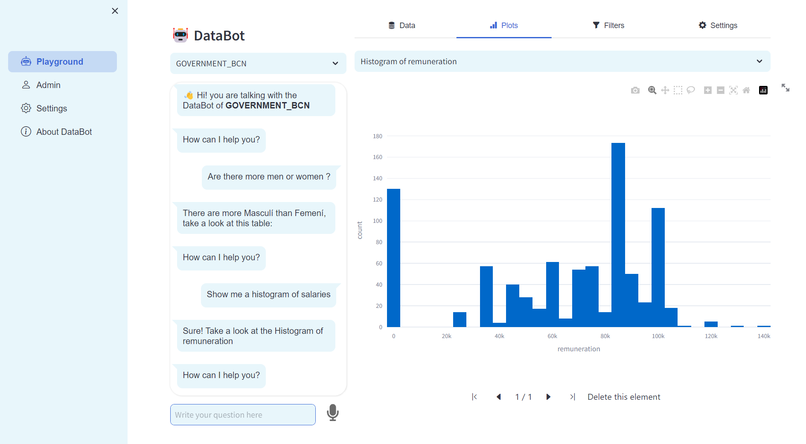

# DataBot: Reliable data exploration through chatbots

This platform is used to create bots whose job is to answer questions about a specific data source. It allows the automatic
generation of a chat/voice bot swarm to attend all the data sources in an **Open Data Portal**.

The highlights of DataBot are:

- 💻 **Import data** through a friendly UI.
  - 💾 Upload your dataset directly to the platform, or...
  - 🌐 Automatically load all the data sources from an Open Data Portal through its API.
- 🔎 A **data schema** is automatically inferred from the data source, and can be **enhanced** 💪 to improve the bot knowledge about 
  the data (e.g., synonyms or translations). This can be done either manually or using ✨AI.
- 🤖 **Automatically generate a chatbot for each data source**. These chatbots are powered by the [**BESSER Bot Framework**](https://github.com/BESSER-PEARL/bot-framework).
  They recognize the user intent and generate the appropriate answer. So, no hallucinations at all.
- Generation of tabular📅 and graphical📈 answers.
- 🎙️ Interact with the chatbots either writing or speaking: **voice recognition integrated**.
- ✨ For those questions the bot fails to identify, AI can be used to generate the best possible answer.
- ✨ For the AI components (data schema enhancement and answer generation), we use the OpenAI API.



### Requirements

- Python 3.11
- Recommended: Create a virtual environment (e.g. [venv](https://docs.python.org/3/library/venv.html), [conda](https://conda.io/projects/conda/en/latest/user-guide/tasks/manage-environments.html))

### Installation

```bash
git clone https://github.com/BESSER-PEARL/databot
cd databot
pip install -r requirements.txt
python main.py
```

### License

This project is licensed under the [MIT](https://mit-license.org/) license

Copyright © 2023 Luxembourg Institute of Science and Technology. All rights reserved.
